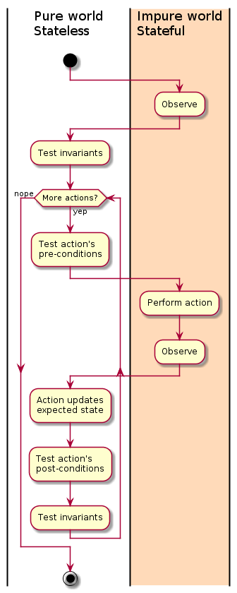

# Scala Test-State

Test **stateful** stuff **statelessly**, and reasonably.

# Contents

- [What is this?](#what-is-this)
- [How does this work?](#how-does-this-work)
- How do I use this?
  - [Usage](doc/USAGE.md)
  - [Types](doc/TYPES.md)
  - [DSL](doc/DSL.md)
  - [Composability](doc/COMPOSE.md)
- [Modules](#modules)
- [Examples](#examples)
- [Changelogs](doc/changelog) — [Latest](doc/changelog/2.2.3.md)
- [Support](#supportexamples)

# What is this?

Firstly, a quick mention of what this *is not*:

1. This is not a test *framework*.
    Use it conjunction with ScalaTest, Specs2, μTest, etc.

1. This is not a property testing library.
    Use it conjunction with ScalaCheck, Nyaya, ScalaProps, etc.

Ok, so what *is* this?
This is a library that:

1. Lets you write pure, immutable, referentially-transparent tests
   that verify stateful, effectful code or data.

1. Encourages composability of test concepts such as invariants/properties, pre/post conditions,
   dynamic actions/assertions, and more.

1. Makes test failure and inspection easy to comprehend.

### Uses

* Unit-test a webapp with Scala.JS.
* Test DB triggers, or a DB migration.
* Integration-test.
* Random-test (fuzz-test) like Android's `monkeyrunner` or ScalaCheck's `Command` API.
* UAT automation.

### Features

* Compiled for Scala & Scala.JS.
* Can run synchronously, asynchronously (`Future`) or in your own context-type (eg `Task`). Is stack-safe.
* Everything is immutable and composable.
* Everything can be transformed into (reused in) different contexts.
* Combines property and imperative testing.
* Actions and assertions can be non-deterministic and/or dependent on runtime state.
* Tries to be as transparent and informative as possible about test execution.
* Optionally configurable error type. Use a custom ADT to precisely maintain all forms of failure and error in your domain.
* Includes a utility called `DomZipper` which greatly simplifies the task of HTML/SVG observation.
* Extension modules for various 3rd-party libraries. (Scalaz, Cats, more.)

# How does this work?

The key is to take **observations** of anything relevant in the stateful test subject.
Observations are like immutable snapshots.
They capture what the state was at a particular point in time.
Once an observation is captured, assertions are performed on it.

Optionally, you can specify some kind of test-only state that you modify as you test,
and use to ensure the real-world observations are what you expect.
 For example, if you're testing a bank account app, you could maintain your own expected balance such that
when you instruct the app to make a deposit, you add the same amount to your state.
You could then add an invariant that whenever the balance is shown in the app, it matches the expected state balance.

This is a (simplified) model of how tests are executed:

When retries are enabled, then test execution is
[like this](https://rawgit.com/japgolly/test-state/master/doc/retries.gv.svg).

# How do I use this?
  - [Usage](doc/USAGE.md)
  - [Types](doc/TYPES.md)
  - [DSL](doc/DSL.md)
  - [Composability](doc/COMPOSE.md)

# Modules

| Module                | Description | Platforms |
|-----------------------|-------------|-----------|
| `core`                | The core module. | JVM + JS |
| `dom-zipper`          | Standalone utility for observing web DOM with precision with conciseness. This is the base API; concrete implementations below. | JVM + JS |
| `dom-zipper-selenium` | DOM zipper built on [Selenium](https://www.seleniumhq.org). | JVM |
| `dom-zipper-sizzle`   | DOM zipper built on [Sizzle](https://sizzlejs.com/). | JS |
| `ext-cats`            | Extensions for [Cats](https://github.com/typelevel/cats). | JVM + JS |
| `ext-nyaya`           | Extensions for [Nyaya](https://github.com/japgolly/nyaya). | JVM + JS |
| `ext-scalajs-react`   | Extensions for [scalajs-react](https://github.com/japgolly/scalajs-react). | JS |
| `ext-scalaz`          | Extensions for [Scalaz](https://github.com/scalaz/scalaz). | JVM + JS |
| `ext-selenium`        | Extensions for [Selenium](https://www.seleniumhq.org). | JVM |

# Examples

* [Scala.Js + React](example-react) - Demonstrates DomZipper, invariants, actions, basics.
* [Selenium](example-selenium) - Demonstrates Selenium testing of external web content, using retry scheduling (instead of `Thread.sleep`), parallelism and concurrency.
* [TODO] DB triggers.    - real external state, ref.
* [TODO] Mutable sample. - fuzz, invariants.

# Support
If you like what I do
—my OSS libraries, my contributions to other OSS libs, [my programming blog](https://japgolly.blogspot.com)—
and you'd like to support me, more content, more lib maintenance, [please become a patron](https://www.patreon.com/japgolly)!
I do all my OSS work unpaid so showing your support will make a big difference.
