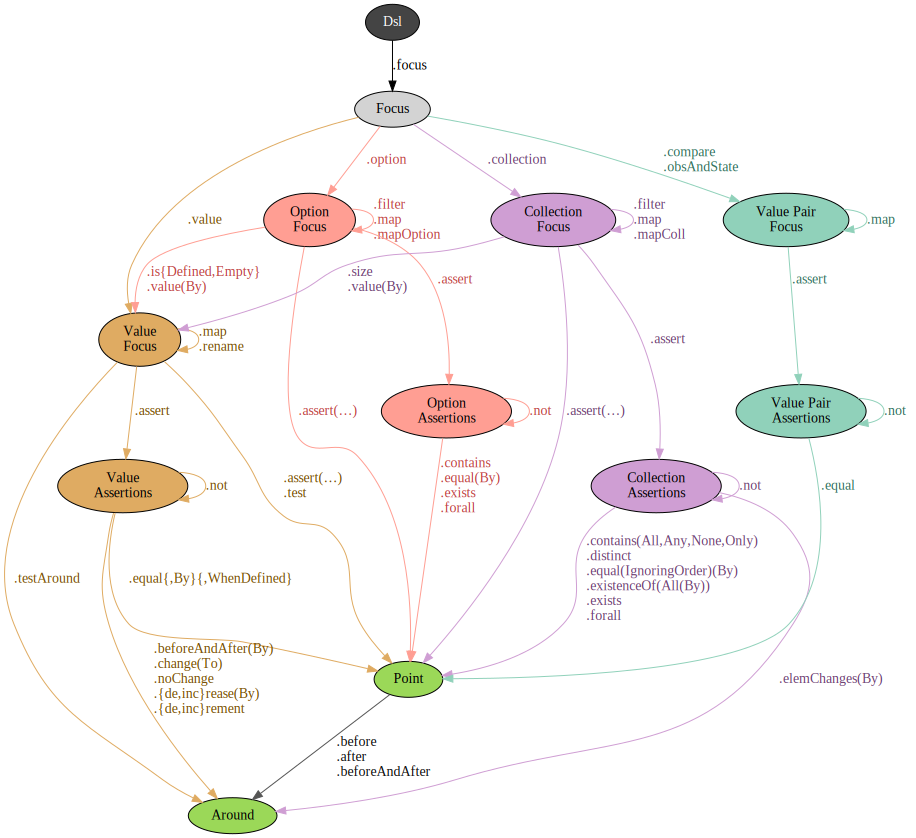

# DSL

Create a dsl instance by simply calling `Dsl.apply`, example:

```scala
import MyTestState._

val dsl = Dsl[Ref, Obs, State]

// dsl.emptyAction: Actions[Id, Ref, Obs, State, String]
```

or if you want asynchronous tests, you can use the helper method `Dsl.future`, example:

```scala
import MyTestState._
import scala.concurrent.ExecutionContext.Implicits.global

val dsl = Dsl.future[Ref, Obs, State]

// dsl.emptyAction: Actions[Future, Ref, Obs, State, String]
```

Once you have an instance, you can create your test content as follows:


You can create assertions here but it's more convenient to use the *focus* DSL below.
Instead, the most common path here is the `Action` path.
The majority of your test actions will be created like this:

```scala
// .action .apply is the most common path
dsl.action("Launch missiles")(_.missiles.nukes.launchAllNow())
```

## Focus

*Focus* DSL exists to allows you make assertions easily and repeatedly,
about a particular value, or number of values.



Examples:
```scala
// Focus on a single value
val moneyRemaining = dsl.focus("Money remaining").value(_.obs.balance)
moneyRemaining.assert(0)
moneyRemaining.assert.beforeAndAfter(500, 600)
moneyRemaining.assert.increaseBy(100)
moneyRemaining.assert.noChange

// Focus on a collection
val names = dsl.focus("User names").collection(_.obs.userNameList)
names.assert.distinct
names.assert.contains("Bob")
names.assert.equalIgnoringOrder("Bob", "Jane")
names.size.assert.decrement

// Comparing observation & expected state
val itemCount = dsl.focus("Item count").obsAndState(_.items.size, _.expectedCount)
itemCount.assert.equal
itemCount.assert.not.equal
itemCount.obs.assert(0)
```
