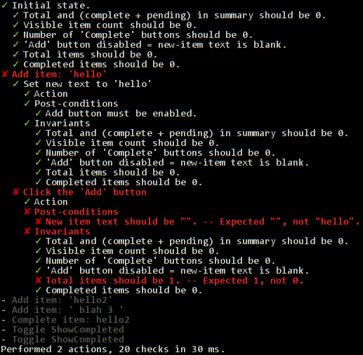

# Usage

- [Project Setup](#project-setup)
- [Writing Tests](#writing-tests)
- [Running Tests](#running-tests)


# Project Setup

1. Choose dependencies and add to SBT.
    <br>Module descriptions are [here](../README.md#modules). Take what you need and delete the rest.
    ```scala
    val TestStateVer = "2.3.0"

    libraryDependencies ++= Seq(
      "com.github.japgolly.test-state" %%% "core"              % TestStateVer % "test",
      "com.github.japgolly.test-state" %%% "dom-zipper"        % TestStateVer % "test",
      "com.github.japgolly.test-state" %%% "dom-zipper-sizzle" % TestStateVer % "test",
      "com.github.japgolly.test-state" %%% "ext-cats"          % TestStateVer % "test",
      "com.github.japgolly.test-state" %%% "ext-nyaya"         % TestStateVer % "test",
      "com.github.japgolly.test-state" %%% "ext-scalajs-react" % TestStateVer % "test",
      "com.github.japgolly.test-state" %%% "ext-scalaz"        % TestStateVer % "test")
    ```

    <br>Please note that if your sbt is setup to use [scalajs-bundler](https://scalacenter.github.io/scalajs-bundler/), *currently* you still need to enable the older JsDependenciesPlugin for the js dependencies from above to be included in your final js file. For example:
    ```scala
       lazy val client = (project in file("client"))
          .enablePlugins(ScalaJSPlugin)
          .enablePlugins(ScalaJSBundlerPlugin)
          .enablePlugins(JSDependenciesPlugin)   ← This is needed even if you are managing your other js depndencies using scalajs-bundler
   
       npmDependencies in Compile ++= Seq( "react"     -> "16.13.1", "react-dom" -> "16.13.1") ← scalajs-bundler style external js dependencies 
       ....
    ```        
    
    
    


1. Create a configuration for your needs.
    <br>Each module has a `trait` containing all of its public API.
    Mix them into your own `object`. Later you can add additional configuration such as settings,
    or typeclasses for your data types.
    ```scala
    package my.app.test

    object MyTestState
      extends teststate.Exports                    // Core. Most important piece.
         with teststate.domzipper.jsoup.Exports    // This already extends Core
         with teststate.domzipper.selenium.Exports // This already extends Core
         with teststate.domzipper.sizzle.Exports   // This already extends Core
         with teststate.ExtCats
         with teststate.ExtNyaya
         with teststate.ExtScalaJsReact
         with teststate.ExtScalaz
    {
      // Additional config here if desired.

      // Example: customise how BankAccounts are displayed in test output.
      implicit val displayBankAccount: Display[BankAccount] =
        Display(_.accountNo)
    }
    ```

# Writing Tests

1. [Choose your types](TYPES.md).
   This nearly always involves creating a small class for your *Observations*.
1. [Create a `Dsl` instance](DSL.md). Use your DSL to create actions, assertions and invariants.
1. [Compose everything](COMPOSE.md) to create a `Test`.

# Running Tests

1. On your `Test`, call `.run` to execute it.
    <br>*(Technically execution depends on the context as described in [TYPES.md](TYPES.md).
    E.g. if the context is a `scalaz.effect.IO` then nothing will have been executed yet and you're free to call `.unsafePerformIO` yourself.)*

1. The result will be a `Report[E]` where `E` (the error type) is by default a `String`.
   You're free to inspect the results if desired but...

1. Most likely you will just want to call `.assert()`, which print results to the screen and throws an exception on failure.

   Like this: 


This project also comes with example projects.
<br>If the above is unclear, reading/running one of the example projects will help.
